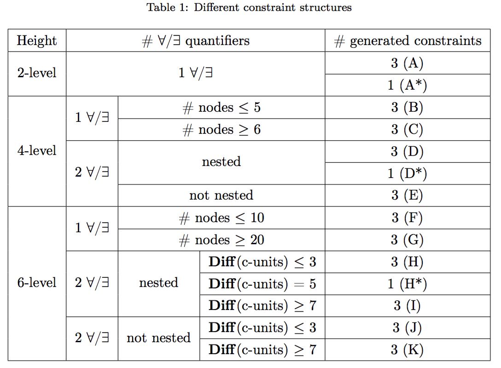

# Latex排版Tips
很多问题可以在[这里](http://tex.stackexchange.com/)搜索到答案。

## 公式
点击[这里](https://www.sharelatex.com/learn/Aligning_equations_with_amsmath)

## 图片

1. [自定义标题样式](http://www.peteryu.ca/tutorials/publishing/latex_captions)
2. 子图
	
	子图主要会用到下面两个包中的一个，有时可以配合minipage使用。
	- [subfig](http://download.nus.edu.sg/mirror/ctan/macros/latex/contrib/subfig/subfig.pdf)
	- [subfigure](http://www.ctex.org/documents/packages/float/subfigure.pdf) 
	
	> subfig和subfigure包不兼容，推荐使用subfig包，subfigure被deprecate了。

## 表格

例子

~~~
\begin{table} 
\renewcommand{\arraystretch}{1.3} 
\centering
\caption{Different constraint structures} 
\label{Different constraint structures} 
%\setlength{\tabcolsep}{10pt} 
\begin{tabular}{|c|c|c|c|c|}      
\hline 
Height & \multicolumn{3}{c|}{{\# $\forall$/$\exists$ quantifiers}} & \# generated constraints \\ 
\hline 
\multirow{2}{*}{2-level} & \multicolumn{3}{c|}{\multirow{2}{*}{1 $\forall$/$\exists$}} & 3 (A)\\ 
\cline{5-5} 
&\multicolumn{3}{c|}{} & 1 (A*)\\ 
\hline 
\multirow{5}{*}{4-level} & \multirow{2}{*}{1 $\forall$/$\exists$} & \multicolumn{2}{c|}{\# nodes $\leq$ 5} & 3 (B)\\ 
\cline{3-5} 
&& \multicolumn{2}{c|}{\# nodes $\geq$ 6} & 3 (C)\\ 
\cline{2-5} 
& \multirow{3}{*}{2 $\forall$/$\exists$} & \multicolumn{2}{c|}{\multirow{2}{*}{nested}} & 3 (D)\\ 
\cline{5-5} 
& & \multicolumn{2}{c|}{} & 1 (D*)\\ 
\cline{3-5} && \multicolumn{2}{c|}{not nested} & 3 (E)\\ 
\hline \multirow{7}{*}{6-level} & \multirow{2}{*}{1 $\forall$/$\exists$} & \multicolumn{2}{c|}{\# nodes $\leq$ 10} & 3 (F)\\ 
\cline{3-5} 
& & \multicolumn{2}{c|}{\# nodes $\geq$ 20} & 3 (G)\\ 
\cline{2-5} 
&\multirow{3}{*}{2 $\forall$/$\exists$} & \multirow{3}{*}{nested} & \textbf{Diff}(c-units) $\leq$ 3 & 3 (H)\\ 
\cline{4-5} 
& & & \textbf{Diff}(c-units) = 5 & 1 (H*)\\ 
\cline{4-5} 
& & & \textbf{Diff}(c-units) $\geq$ 7 & 3 (I)\\ 
\cline{2-5} 
&\multirow{2}{*}{2 $\forall$/$\exists$} &\multirow{2}{*}{not nested}& \textbf{Diff}(c-units) $\leq$ 3 & 3 (J)\\ 
\cline{4-5} 
& & & \textbf{Diff}(c-units) $\geq$ 7 & 3 (K)\\ 
\hline 
\end{tabular}\\ 
\end{table}
~~~

效果：

## 算法

## 模板
1. 研究生毕业论文

	- [杨文博版本](https://code.google.com/archive/p/njuthesis/downloads)

	- [胡海星版本](http://haixing-hu.github.io/nju-thesis/) 

